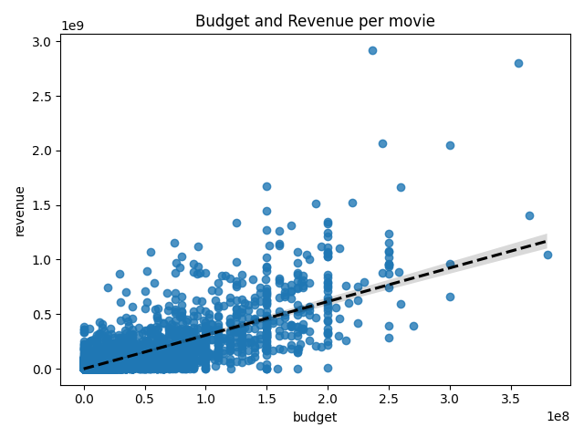

# Final Project - Analysis of Movies

Author: William Borenstein

### Business problem:
For this project, I will produce a MySQL database on Movies from 2000 to 2019 from a subset of IMDB's publicly available dataset. Ultimately, I will use this database to analyze what makes a movie successful and will provide recommendations to the stakeholder on how to make a successful movie. This project will use a combination of machine-learning-model-based insights and hypothesis testing to extract insights for the stakeholders.

### Goals: 
 - Predict what makes a movie successful. 
 - Determine if the MPAA ratings (G, PG,...) of a movie affect how much revenue the movie generates.
 - Use a Linear Regression model to predict the revenue a movie will generate.

### Data
This data set is a conglomerate of different tables recovered from tbdm.com and imdb.com. This data set has 5,3019 rows and 25 columns. During my hypothesis test I will be focusing on movie ratings. When modeling, the target column that I will try to predict is the total revenue a film is expected to generate. Some of the other key features of the data are budget, genres and popularity.

## Methodology
 - Part 1: Download several files from IMDB’s movie data set and filter out the subset of movies requested by the stakeholder.
 
 - Part 2: Use an API to extract box office revenue and profit data to add to the IMDB data.
 
 - Part 3: Perform exploratory data analysis.
 
 - Part 4: Apply an E.T.L process on previously saved movie data. Construct and export a MySQL database using the extracted data, which includes preparing the data for a relational database.
 
 - Part 5: Apply hypothesis testing to explore what makes a movie successful.
 
 - Part 6: Produce a Linear Regression model to predict movie performance.

## Preliminary Data Exploration
Visual #1

From Visual #1 above we can see any features that strongly correlate with one another. From here we can see that budget and revenue, budget and view count and revenue and view count have strong correlations with each other. 

Visual #2

Above we can see the budget per movie and how much revenue that particular movie generated.

Visual #3

From this bar plot we can see how many movies there are in each movie rating that we pulled.

Visual #4

In this barplot we can see the amount of revenue based on movie rating.

## Hypothesis Testing
**Do some MPAA Ratings make more revenue than others?**

**Hypothesis**

- $H_0:$ The MPAA ratings have no effect how much revenue the movie generates.
- $H_1:$ The MPAA rating does effect how much revenue the movie makes.
 
 Data Type : Numeric (Revenue)
 
 Samples: More than 2 samples/groups
 
 Test: ANOVA and/or Tukey
 
 Assumptions: 
 
    - No significant outliers
    - Equal variance
    - Normality

**Outliers Removed**
 - Rating  R -> Number of outliers :  112
 - Rating  PG-13 -> Number of outliers :  80
 - Rating  UR -> Number of outliers :  28
 - Rating  PG -> Number of outliers :  37
 - Rating  G -> Number of outliers :  10
 - Rating  NC-17 -> Number of outliers :  2

**Normality Assumption**
 - We failed the test for normality. However, we can still proceed as planned because we have more then 15 samples in each group.

**Equal Variance**
 - Because we failed the test of equal variance we have to perform a Kruskal-Wallis test instead of a One Way ANOVA test. 

**Final Conclusion**

    Test Results: KruskalResult(statistic=1764.3856914319545, pvalue=0.0)
Explanation: In this case we have a significant p-value which means we reject our null hypothesis and support our alternative hypthesis that "The MPAA rating does effect how much revenue the movie generates".

**Post-Hoc** 

We can determine from a Post-Hoc Multiple Comparison Test that movies rated R, UR and NC-17 made significantly less in revenue than all other ratings. 

## Other Hypotheses we can test for...
 - Q: Do movies that have longer movies earn more revenue than shorter ones?

 - Q3: Do movies released in particular years ern more or less then movies in other years?

 - Q: Do some movie genres earn more revenue than others?

## Regression Model-Based Insights
 - Finally I used a Linear Regression Model with the help of feature engineering and other machine learning models to predict movie revenue to extract insights and recommendations on what features of a movie are positive/negative predictors of success.
 
 
### Best Model
**QQ-Plot** (left) **Residual Plot** (right)

**Final Training Scores**

<!--  -->
                          OLS Regression Results   
                          
==============================================================================
Dep. Variable:                revenue   R-squared:                       0.788
Model:                            OLS   Adj. R-squared:                  0.783
Method:                 Least Squares   F-statistic:                     166.6
Date:                Mon, 28 Nov 2022   Prob (F-statistic):               0.00
Time:                        15:13:39   Log-Likelihood:                -68464.
No. Observations:                3575   AIC:                         1.371e+05
Df Residuals:                    3496   BIC:                         1.376e+05
Df Model:                          78                                         
Covariance Type:            nonrobust 

======================================================================================================
                                         coef    std err          t      P>|t|      [0.025      0.975]

------------------------------------------------------------------------------------------------------
const                               7.034e+07   5.44e+06     12.925      0.000    5.97e+07     8.1e+07
adult                               1.036e+05   8.51e+05      0.122      0.903   -1.56e+06    1.77e+06
budget                              5.012e+07   1.34e+06     37.312      0.000    4.75e+07    5.28e+07
popularity                            6.7e+06   1.23e+06      5.457      0.000    4.29e+06    9.11e+06
runtime                             2.364e+06   1.02e+06      2.323      0.020    3.68e+05    4.36e+06
vote_average                        -3.45e+04      1e+06     -0.034      0.973      -2e+06    1.93e+06
vote_count                            4.9e+07   1.29e+06     37.867      0.000    4.65e+07    5.15e+07
year                                2.792e+05   9.37e+05      0.298      0.766   -1.56e+06    2.12e+06
month                               3.459e+05   8.66e+05      0.400      0.690   -1.35e+06    2.04e+06
day                                -2.273e+05    8.6e+05     -0.264      0.792   -1.91e+06    1.46e+06
belongs_to_collection               3.694e+07   2.36e+06     15.629      0.000    3.23e+07    4.16e+07
Genre_Comedy                        8.543e+06   2.22e+06      3.851      0.000    4.19e+06    1.29e+07
Genre_Music                         1.134e+07   5.44e+06      2.085      0.037    6.76e+05     2.2e+07
Genre_Romance                       7.255e+06   2.47e+06      2.936      0.003    2.41e+06    1.21e+07
Genre_Science Fiction              -2.789e+07   3.32e+06     -8.400      0.000   -3.44e+07   -2.14e+07
Genre_Drama                        -1.867e+06   2.23e+06     -0.836      0.403   -6.25e+06    2.51e+06
Genre_Action                       -2.926e+06   2.39e+06     -1.226      0.220   -7.61e+06    1.76e+06
Genre_Crime                        -8.502e+06   2.65e+06     -3.210      0.001   -1.37e+07   -3.31e+06
Genre_Adventure                    -1.514e+06   2.88e+06     -0.525      0.600   -7.17e+06    4.14e+06
Genre_Animation                     2.116e+07   4.58e+06      4.619      0.000    1.22e+07    3.01e+07
Genre_Fantasy                      -1.094e+07   3.26e+06     -3.357      0.001   -1.73e+07   -4.55e+06
Genre_Horror                       -2.168e+06   3.28e+06     -0.661      0.509    -8.6e+06    4.27e+06
Genre_Thriller                      1.154e+06   2.35e+06      0.492      0.623   -3.45e+06    5.76e+06
Genre_History                      -1.202e+06   4.26e+06     -0.282      0.778   -9.55e+06    7.14e+06
Genre_Family                        5.307e+06   3.82e+06      1.390      0.165   -2.18e+06    1.28e+07
Genre_Mystery                      -4.642e+06   3.24e+06     -1.432      0.152    -1.1e+07    1.71e+06
Genre_Western                      -2.241e+07   8.94e+06     -2.506      0.012   -3.99e+07   -4.88e+06
Genre_War                          -1.011e+07   4.91e+06     -2.059      0.040   -1.97e+07   -4.85e+05
Genre_TV Movie                      1.778e-08   1.65e-08      1.075      0.282   -1.46e-08    5.02e-08
Genre_Documentary                   2.835e+07   2.59e+07      1.097      0.273   -2.23e+07     7.9e+07
has_prod_company                    -8.62e+06   4.98e+06     -1.731      0.083   -1.84e+07    1.14e+06
ProdComp_20th Century Fox            2.35e+07   5.31e+06      4.424      0.000    1.31e+07    3.39e+07
ProdComp_BBC Films                 -1.138e+06   8.54e+06     -0.133      0.894   -1.79e+07    1.56e+07
ProdComp_Blumhouse Productions      7.461e+06   9.13e+06      0.817      0.414   -1.04e+07    2.54e+07
ProdComp_CJ Entertainment           5.492e+06   9.93e+06      0.553      0.580    -1.4e+07     2.5e+07
ProdComp_CNC                        6.984e+05   9.92e+06      0.070      0.944   -1.87e+07    2.01e+07
ProdComp_Canal+                    -8.094e+06   6.16e+06     -1.313      0.189   -2.02e+07    3.99e+06
ProdComp_Ciné+                      1.263e+07   1.02e+07      1.237      0.216   -7.39e+06    3.26e+07
ProdComp_Columbia Pictures         -1.324e+06    4.7e+06     -0.282      0.778   -1.05e+07    7.89e+06
ProdComp_Dimension Films           -7.886e+06   8.48e+06     -0.930      0.352   -2.45e+07    8.73e+06
ProdComp_DreamWorks Pictures        1.247e+07   6.16e+06      2.026      0.043       4e+05    2.45e+07
ProdComp_Dune Entertainment         5.302e+06   7.98e+06      0.664      0.507   -1.04e+07     2.1e+07
ProdComp_Epsilon Motion Pictures   -1.342e+07   9.32e+06     -1.440      0.150   -3.17e+07    4.85e+06
ProdComp_EuropaCorp                -2.066e+07   1.02e+07     -2.035      0.042   -4.06e+07   -7.58e+05
ProdComp_Film4 Productions         -1.912e+07   9.03e+06     -2.118      0.034   -3.68e+07   -1.42e+06
ProdComp_Focus Features            -3.695e+06   7.47e+06     -0.494      0.621   -1.83e+07     1.1e+07
ProdComp_Fox 2000 Pictures           1.64e+07   9.22e+06      1.779      0.075   -1.67e+06    3.45e+07
ProdComp_Fox Searchlight Pictures  -2.876e+06    7.6e+06     -0.378      0.705   -1.78e+07     1.2e+07
ProdComp_France 2 Cinéma           -8.426e+06   9.29e+06     -0.907      0.365   -2.66e+07    9.79e+06
ProdComp_France 3 Cinéma           -1.407e+06   9.82e+06     -0.143      0.886   -2.07e+07    1.78e+07
ProdComp_Ingenious Media            3.844e+06   1.03e+07      0.371      0.710   -1.64e+07    2.41e+07
ProdComp_Lakeshore Entertainment   -5.186e+06   1.02e+07     -0.508      0.611   -2.52e+07    1.48e+07
ProdComp_Legendary Pictures         1.527e+07   1.08e+07      1.419      0.156   -5.84e+06    3.64e+07
ProdComp_Lionsgate                 -1.021e+07    5.5e+06     -1.856      0.064    -2.1e+07    5.75e+05
ProdComp_MISSING                   -1.524e-08   9.11e-09     -1.673      0.094   -3.31e-08    2.62e-09
ProdComp_Metro-Goldwyn-Mayer       -4.512e+06   6.55e+06     -0.689      0.491   -1.74e+07    8.33e+06
ProdComp_Millennium Films          -1.919e+07   8.79e+06     -2.183      0.029   -3.64e+07   -1.96e+06
ProdComp_Miramax                   -1.212e+07    7.2e+06     -1.682      0.093   -2.62e+07    2.01e+06
ProdComp_New Line Cinema            9.914e+06   5.53e+06      1.793      0.073   -9.26e+05    2.08e+07
ProdComp_New Regency Pictures      -3.264e+07   1.17e+07     -2.781      0.005   -5.56e+07   -9.63e+06
ProdComp_Original Film              -7.64e+06    9.3e+06     -0.822      0.411   -2.59e+07    1.06e+07
ProdComp_Paramount                  2.098e+06   4.57e+06      0.459      0.647   -6.87e+06    1.11e+07
ProdComp_Regency Enterprises        1.805e+07   1.04e+07      1.739      0.082    -2.3e+06    3.84e+07
ProdComp_Relativity Media          -1.467e+06   5.85e+06     -0.251      0.802   -1.29e+07       1e+07
ProdComp_Revolution Studios        -1.341e+07    9.8e+06     -1.368      0.171   -3.26e+07     5.8e+06
ProdComp_Scott Rudin Productions   -1.295e+07   9.53e+06     -1.359      0.174   -3.16e+07    5.73e+06
ProdComp_Screen Gems                1.214e+07   7.74e+06      1.570      0.117   -3.02e+06    2.73e+07
ProdComp_Sony Pictures              2.542e+07   7.32e+06      3.475      0.001    1.11e+07    3.98e+07
ProdComp_Spyglass Entertainment     3.919e+06   9.73e+06      0.403      0.687   -1.52e+07     2.3e+07
ProdComp_StudioCanal               -3.505e+06   6.64e+06     -0.528      0.598   -1.65e+07    9.52e+06
ProdComp_Summit Entertainment      -8.891e+06   7.44e+06     -1.195      0.232   -2.35e+07     5.7e+06
ProdComp_TF1 Films Production       2.118e+07   1.04e+07      2.041      0.041    8.35e+05    4.15e+07
ProdComp_TSG Entertainment         -2.272e+07   9.41e+06     -2.414      0.016   -4.12e+07   -4.26e+06
ProdComp_The Weinstein Company     -2.162e+07   9.07e+06     -2.384      0.017   -3.94e+07   -3.84e+06
ProdComp_Touchstone Pictures        8.746e+05   7.27e+06      0.120      0.904   -1.34e+07    1.51e+07
ProdComp_Universal Pictures         9.431e+06   4.22e+06      2.235      0.025    1.16e+06    1.77e+07
ProdComp_Village Roadshow Pictures   2.04e+06   7.33e+06      0.278      0.781   -1.23e+07    1.64e+07
ProdComp_Walt Disney Pictures       1.065e+07   6.48e+06      1.643      0.101   -2.06e+06    2.34e+07
ProdComp_Warner Bros. Pictures     -7.523e+06   4.65e+06     -1.617      0.106   -1.66e+07     1.6e+06
ProdComp_Wild Bunch                -1.477e+07   9.67e+06     -1.528      0.127   -3.37e+07    4.18e+06
ProdComp_Working Title Films          6.3e+06   9.59e+06      .0657      .0511   -1.25e+07    2.51e+07

======================================================================================================
Omnibus:                     1043.231   Durbin-Watson:                   2.054
Prob(Omnibus):                  0.000   Jarque-Bera (JB):             9092.228
Skew:                           1.135   Prob(JB):                         0.00
Kurtosis:                      10.475   Cond. No.                     1.28e+16

======================================================================================================
Notes:
[1] Standard Errors assume that the covariance matrix of the errors is correctly specified.
[2] The smallest eigenvalue is 5.9e-29. This might indicate that there are
strong multicollinearity problems or that the design matrix is singular.

**Graph of coefficients**

**Final Testing Scores**

 - r-square : is 0.723 
 - Mean Squared Error(MSE) : 3.343948e+15.

<!-- Optional headings to add -->

## Conclusion
 - My model can explain approximately 72 percent of the variance when predicting how much revenue a movie will be able to generate.
 - Based on the Post-Hoc Multiple Comparison Test performed above, we can conclude that movies rated R, UR and NC-17 made significantly less in revenue than other ratings that were studied. 
 
## Limitations & Next Steps: 
One way we could enhance this model would be to add more hyper-parameter tuning on more variables. We could also gather more films from a paid API which could give more insite as well as look farther back in time for films that were maded before 2000.

Also, other Feature Engineering could have been performed with more knowledge of the subject matter. An expert could be consulted on which what features can be modified for better results.

## For further information 
zevy613@gmail.com
